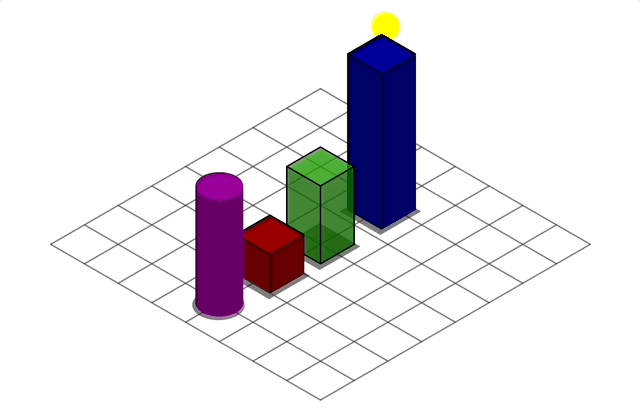

# Skewed

Skewed is a Typescript package for generating SVG of 3D graphics in real-time or offline files. It has an opionated default look and orthographic projection only camera support, isometric by default.

Use it to make simple 3D infographics, 3D web-games, or generate 3D SVG files for importing into vector editors like Figma/Illustrator (Ie. make 3D icons).

[Live demo](https://vgyf3c.csb.app/)




# Usage

 1. `npm install skewed`
 1. API examples coming soon
     1. In the meantime see: https://codesandbox.io/s/skewed-demo-vgyf3c?file=/src/index.ts

## Contributing

#### Setup

1. Install dependencies
   1. Node.js
   1. pnpm
1. Clone and go into the folder
   ```
   git clone git@github.com:seflless/skewed.git
   cd skewed
   ```

#### Dev

To serve up the workbench web-page and rebuild on code changes run the following.

```
pnpm dev
# Open the workbench page at http://localhost:3000/
```

#### Building

```
pnpm build
```

#### Testing

**TBD**

#### Publishing to NPM

Do the usual npm version bump then publish.

```
# Make sure tests pass. `pnpm test` (we should automate this in a publish command)
pnpm build
npm version <major|minor|patch>
git push; git push --tags
npm publish
```

#### Test

Using vitest, the test are rerun whenever you change related code.

```
pnpm test
```

#### Watch Tests

TODO: Do we need to put in a difference command for the CLI?

# Prio Art

Here are some cool existing project I found after starting this. In no particular order:

## ZDog

- [Project Website](https://zzz.dog/)
- [Github repo](https://github.com/metafizzy/zdog)
- Great article covering it: https://css-tricks.com/zdog/
- I found this one when looking for ideas about how to light 3D spheres.
- Love the cool art style in the demos that it's well suited too.
- Finding a good artist/art-style to use as guodance (and demos) will go really far. The homepage demo is based on this 2D art: https://www.robindavey.co.uk/#/nippu/
- There's no lighting support, but that really simplifies things for this art style.
  - Here's an example [mini town](https://codepen.io/desandro/pen/vdwMyW) where stylistic lighting (really just contrasting planes) is used
- This influenced me into focusing on toon shading style lighting/graphics too (As allow specifying an amount of shades gradients)
- The documentation is great
  - The style is fun and matches the engines aesthetic
  - Love the coverage of topics like [z-fighting, how it works, and how to work with it](https://zzz.dog/extras#z-fighting)
- It's making me consider supporting a canvas renderer
  - Would be better for mixing into other canvas rendering (Is this true for WebGL, or is copying from canvas to WebGL textures slow?)
  - Read: [Canvas or SVG?](https://zzz.dog/extras#canvas-or-svg)
- [Rendering with SVG without Illustration](https://zzz.dog/extras#rendering-without-illustration-rendering-with-svg-without-illustration)
  - I'd been thinking about doing this same approach, allowing people to take control of rendering order to mix
    compositions into other HTML/SVG
- See some of the [Feature Requests and discussions](https://zzz.dog/extras#feature-requests)
  - [Supporting Perspective cameras, not just ortho](https://github.com/metafizzy/zdog/issues/2)
    - I like encouraging ortho only (and variants like oblique/cabinet)
    - It should be more performant when only translating camera and objects, that's a good thing
    - I'm with this [comment](https://github.com/metafizzy/zdog/issues/2#issuecomment-497310823), it doesn't play well with SVG curve capabilities.
