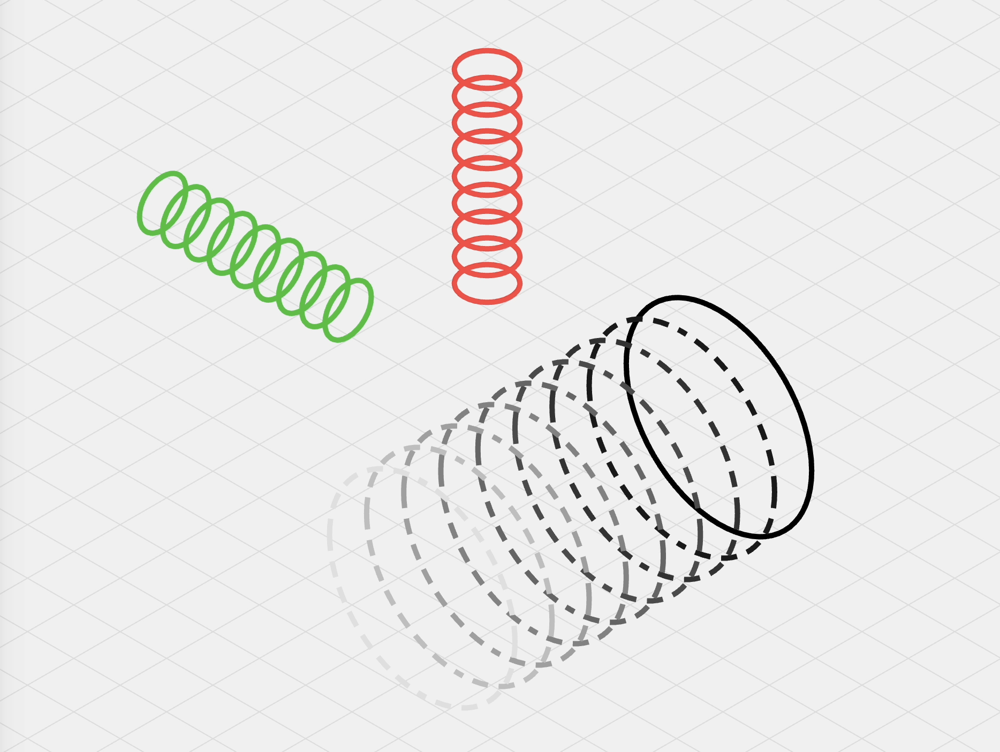

# Skewed

Generate 3D isometric SVGs.

- Typescript-first package
- Built-in standard 3D shapes
- Utility for isometrically transforming 3D points to 2D ones



# Usage

```sh
npm install skewed
```

```ts
// TBD
```

## Contributing

#### Setup

```
git clone git@github.com:seflless/skewed.git
cd skewed
```

#### Watching

```
yarn dev
# Open the workbench page at http://localhost:5173/
```

#### Building

```
yarn build
```

#### Testing

**TBD**

#### Publishing to NPM

Do the usual npm version bump then publish.

```
npm version <major|minor|patch>
git push; git push --tags
npm publish
```

#### Test

Using vitest, the test are rerun whenever you change related code.

```
yarn test
```

#### Watch Tests

TODO: Do we need to put in a difference command for the CLI?
