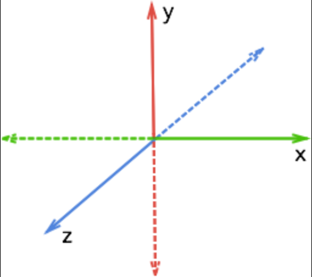
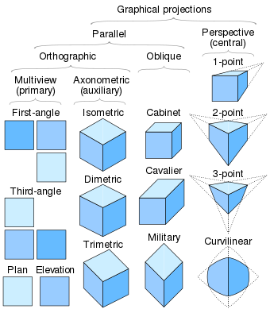

# Skewed

Easily create 3D SVG elements.

- Camera Projections
  - Isometric
- Built in shapes:
  - Box
  - Cylinder


# Usage

```sh
npm install skewed
```

**Coordinate System**



```ts
// TBD
```

## Contributing

#### Setup

1. Install dependencies
   1. Node.js
   1. pnpm
1. Clone and go into the folder
   ```
   git clone git@github.com:seflless/skewed.git
   cd skewed
   ```

#### Watching

```
pnpm dev
# Open the workbench page at http://localhost:3000/
```

#### Building

```
pnpm build
```

#### Testing

**TBD**

#### Publishing to NPM

Do the usual npm version bump then publish.

```
npm version <major|minor|patch>
git push; git push --tags
npm publish
```

#### Test

Using vitest, the test are rerun whenever you change related code.

```
pnpm test
```

#### Watch Tests

TODO: Do we need to put in a difference command for the CLI?

# Todo

- Switch to focusing on imperative core that is react independent
  - Add sorting first and just of boxes initially
- Move to using Github project planning
- Add more core

  - Mesh
    - Points
    - Face
      - Indices
      - Fill? (Fallback to using parent's if not provided)
      - Normal?
      - Single/double-sided flag
    - How will we do colors or generalized material?
      - Start with a fixed color per Face and Shape Level
      - Maybe we don't go material style
    - Add more shapes
      - Floor
        - Grid, flat, invisible or what modes? Or should a grid be flexible and a Floor not exist or just be a wrapper around a Plane
        - Special case? Where it's just an infinite texture that we only have to transform 4 points of?
      - Create generators
        - Prismatics
          - Triangular Prism
          - Cylinder
            - Should we support arcs/donut hole ala what Figma does for ellipses?
        - Flat
          - Support rectangle, ellipse at a minimum
          - Text would be awesome, but should be deffered and be handled at the same time we add prismatic support too.
        - Conics (or is this just a pristmatic with a scalar for the top face's points)
          - Cones. (Do cones similarly to below)
            - https://twitter.com/kaihenthoiwane/status/1667122834060242945?s=46
  - Pick better colors for demoing/screenshots once mesh/face fill si in
  - Bounding primitives (stored in Mesh's coordinate system)
    - BoundingBox first
  - Basic collision utilities
    - Ray casting first. Use to demo an object picker
  - Add proper render loop
    - Add render sorting (initially just sort by center depth)
    - Figure out how we cache a Mesh transform?
  - Figure out how stroke/fill will work?
    - Different styles like: outline, wireframe, edges, and none?
  - Matrix and Group (alt name Frame)
  - Viewport (vs default one)
  - Lighting?
  - Camera

    - Input ray functionality
    - Add more projection styles
      

  - Quaternion?

- Move to pnpm and a monorepo
- Figure out react basics

  - Codevelop react approach with imperative API internals
  - Resolve type naming issues
    - Ie. Can't have Box type used like `<Box/>` and `Box()`. Should we use a built-in like `<box .../>` instead?

- Utilities for
  - Transform 3D points to 2D ones (**TODO**)
  - Simple camera model and control scheme for navigating and zooming in/out (**TODO**)
- React support coming soon, core will be a Vanillar HTML/JS API (unless I change my mind and go React only) (**TODO**)
