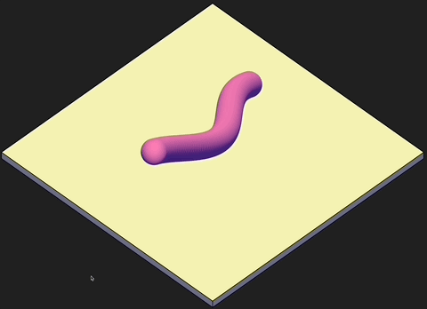
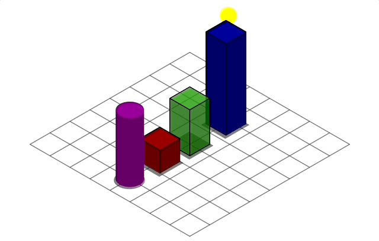
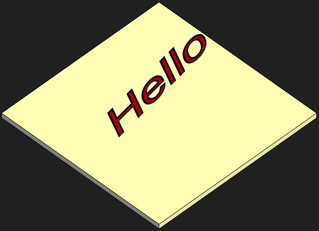

# Skewed

Skewed es un paquete de Typescript para generar SVG de gráficos 3D en tiempo real. Tiene iluminación dinámica básica, cámaras ortográficas, un conjunto de formas integradas y también admite mallas arbitrarias.

Úsalo para crear infografías 3D simples, juegos web en 3D, o generar archivos SVG 3D para importar en editores vectoriales como Figma/Illustrator (es decir, crear iconos 3D).

Aquí tienes una [Demo en vivo](https://vgyf3c.csb.app/). Documentación próximamente.

<!--  -->


# Uso

1.  `npm install skewed`
1.  Consulta el [código fuente](https://codesandbox.io/s/skewed-demo-vgyf3c?file=/src/index.ts) de la [demo en vivo](https://vgyf3c.csb.app/). Más ejemplos de API próximamente. Mientras tanto

## Contribuir

#### Configuración

1. Instalar dependencias
   1. Node.js
   1. pnpm
1. Clonar y navegar a la carpeta
   ```
   git clone git@github.com:seflless/skewed.git
   cd skewed
   ```

#### Desarrollo

Para servir la página web del banco de trabajo y reconstruir cuando haya cambios en el código, ejecuta lo siguiente.

```
pnpm dev
# Abre la página del banco de trabajo en http://localhost:3000/
```

#### Construcción

```
pnpm build
```

#### Pruebas

**Por definir**

#### Publicar en NPM

Haz el incremento de versión habitual de npm y luego publica.

```
# Asegúrate de que las pruebas pasen. `pnpm test` (deberíamos automatizar esto en un comando de publicación)
pnpm build
npm version <major|minor|patch>
git push; git push --tags
npm publish
```

#### Prueba

Usando vitest, las pruebas se vuelven a ejecutar cada vez que cambias código relacionado.

```
pnpm test
```

#### Observar Pruebas

TODO: ¿Necesitamos poner un comando diferente para la CLI?

# Arte Previo

Aquí hay algunos proyectos geniales existentes que encontré después de comenzar este. Sin orden particular:

## ZDog

- [Sitio web del proyecto](https://zzz.dog/)
- [Repositorio de Github](https://github.com/metafizzy/zdog)
- Excelente artículo que lo cubre: https://css-tricks.com/zdog/
- Encontré este cuando buscaba ideas sobre cómo iluminar esferas 3D.
- Me encanta el estilo artístico genial en las demos para las que está bien adaptado.
- Encontrar un buen artista/estilo artístico para usar como guía (y demos) llegará realmente lejos. La demo de la página principal está basada en este arte 2D: https://www.robindavey.co.uk/#/nippu/
- No hay soporte de iluminación, pero eso realmente simplifica las cosas para este estilo artístico.
  - Aquí hay un ejemplo de [mini ciudad](https://codepen.io/desandro/pen/vdwMyW) donde se usa iluminación estilística (realmente solo planos contrastantes)
- Esto me influyó a enfocarme también en el estilo de iluminación/gráficos de sombreado toon (ya que permite especificar una cantidad de gradientes de sombras)
- La documentación es excelente
  - El estilo es divertido y coincide con la estética del motor
  - Me encanta la cobertura de temas como [z-fighting, cómo funciona y cómo trabajar con él](https://zzz.dog/extras#z-fighting)
- Me está haciendo considerar soportar un renderizador de canvas
  - Sería mejor para mezclar en otro renderizado de canvas (¿Es esto cierto para WebGL, o es lento copiar desde canvas a texturas WebGL?)
  - Lee: [¿Canvas o SVG?](https://zzz.dog/extras#canvas-or-svg)
- [Renderizado con SVG sin Illustration](https://zzz.dog/extras#rendering-without-illustration-rendering-with-svg-without-illustration)
  - Había estado pensando en hacer este mismo enfoque, permitir que las personas tomen el control del orden de renderizado para mezclar
    composiciones en otro HTML/SVG
- Ve algunas de las [Solicitudes de características y discusiones](https://zzz.dog/extras#feature-requests)
  - [Soporte de cámaras de perspectiva, no solo ortográficas](https://github.com/metafizzy/zdog/issues/2)
    - Me gusta alentar solo ortográficas (y variantes como oblicua/gabinete)
    - Debería ser más eficiente cuando solo se trasladan cámaras y objetos, eso es algo bueno
    - Estoy de acuerdo con este [comentario](https://github.com/metafizzy/zdog/issues/2#issuecomment-497310823), no funciona bien con las capacidades de curvas SVG.
