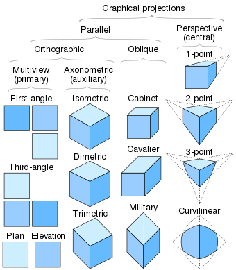

_Todo: Move to using Linear or Github project to track tasks_

- Flush out basics
  - Shape
    - Start with no matrix, just a position
  - Scene
  - Renderer
    - Render sorted by position
    - Use existing Camera -> point3DToIsometric for projection
    - Time willing, add Cabinet projection support
- V2
  - Figure out the Typescript generics to get my new-free style working for all classes like I do for Vector3
    - Started conversation with GPT-4 [here](https://chat.openai.com/c/8123a35d-6a57-4529-b274-533849ace3f6), copy/pasted the first suggestion into utils/Newless.ts, but haven't tested it out
  - Matrix Class
    - Should we have a Matrix4x4 AND Matrix4x3 or just one?
  - Support more projections from
    - Cabinet for sure and maybe even the untilted version like in the Twitter thread I responded to recently
- V3
- Get serializing in early. Make basic tool to serialize a scene or object and make it easy to load in whole scenes, viewports, or object-level snapshots.

## Basic Architecture

- ViewPorts
  - Reference to Scene
  - Current Camera
- Frames
  - Should have a concept of Frames ala Figma, that you use to indicate export bounds? ViewPorts maybe suffice for now?
- Boards
  - Should we have a zoomable interface container officially supported?
- Scene
  - Camera
    - Owns Matrix
  - Shape
    - Owns Matrix
    - Owns Mesh
  - Group
    - For now I'm going to make Shapes and Groups distinct, as in Shapes are leaf nodes. This may not be worth breaking convention where everything can be nested in many engines.
- Renderer
  - Reference to ViewPorts
- ECS / Physics (TBD)

# Archived Todo

- Switch to focusing on imperative core that is react independent
  - Add sorting first and just of boxes initially
- Move to using Github project planning
- Add more core

  - Mesh
    - Points
    - Face
      - Indices
      - Fill? (Fallback to using parent's if not provided)
      - Normal?
      - Single/double-sided flag
    - How will we do colors or generalized material?
      - Start with a fixed color per Face and Shape Level
      - Maybe we don't go material style
    - Add more shapes
      - Floor
        - Grid, flat, invisible or what modes? Or should a grid be flexible and a Floor not exist or just be a wrapper around a Plane
        - Special case? Where it's just an infinite texture that we only have to transform 4 points of?
      - Create generators
        - Prismatics
          - Triangular Prism
          - Cylinder
            - Should we support arcs/donut hole ala what Figma does for ellipses?
        - Flat
          - Support rectangle, ellipse at a minimum
          - Text would be awesome, but should be deffered and be handled at the same time we add prismatic support too.
        - Conics (or is this just a pristmatic with a scalar for the top face's points)
          - Cones. (Do cones similarly to below)
            - https://twitter.com/kaihenthoiwane/status/1667122834060242945?s=46
  - Pick better colors for demoing/screenshots once mesh/face fill si in
  - Bounding primitives (stored in Mesh's coordinate system)
    - BoundingBox first
  - Basic collision utilities
    - Ray casting first. Use to demo an object picker
  - Add proper render loop
    - Add render sorting (initially just sort by center depth)
    - Figure out how we cache a Mesh transform?
  - Figure out how stroke/fill will work?
    - Different styles like: outline, wireframe, edges, and none?
  - Matrix and Group (alt name Frame)
  - Viewport (vs default one)
  - Lighting?
  - Camera

    - Input ray functionality
    - Add more projection styles
      

  - Quaternion?

- Move to pnpm and a monorepo
- Figure out react basics

  - Codevelop react approach with imperative API internals
  - Resolve type naming issues
    - Ie. Can't have Box type used like `<Box/>` and `Box()`. Should we use a built-in like `<box .../>` instead?

- Utilities for
  - Transform 3D points to 2D ones (**TODO**)
  - Simple camera model and control scheme for navigating and zooming in/out (**TODO**)
- React support coming soon, core will be a Vanillar HTML/JS API (unless I change my mind and go React only) (**TODO**)
